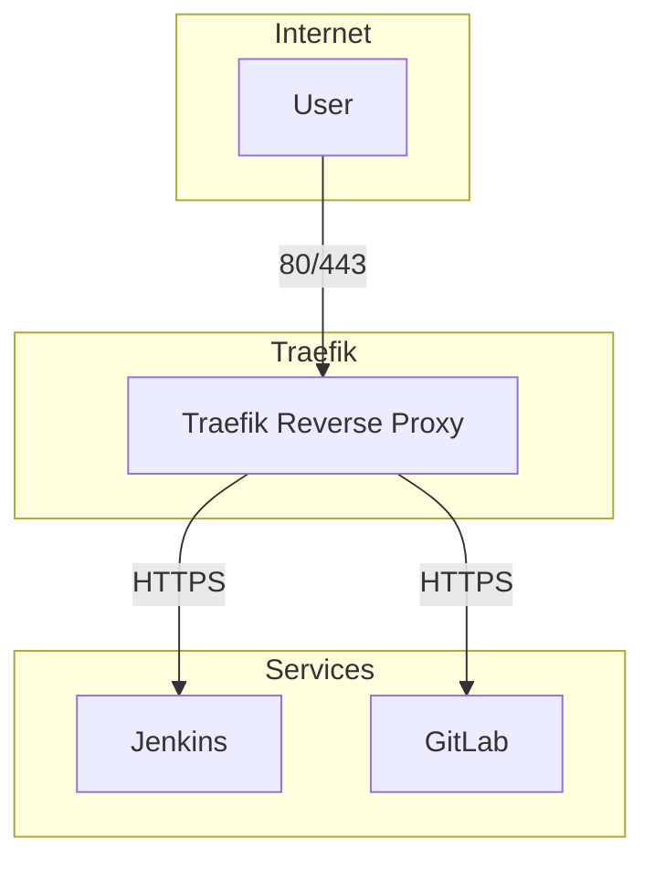

# 🐳 Docker Compose Management

이 프로젝트는 여러 개의 Docker Compose 파일(`base`, `jenkins` 등)을 통합하여 실행합니다.  
복잡한 `docker compose -f ... -f ...` 명령어 대신 **Makefile**을 통해 간단하게 컨테이너를 관리할 수 있습니다.

---

## 🏗️ Infrastructure Diagram


---
## 📂 프로젝트 구조 (예시)

```
.
├── docker-compose.base.yml
├── docker-compose.jenkins.yml
├── Makefile
└── .env
```

---

## ⚙️ 환경 설정

`.env` 파일에는 이메일, 도메인, BasicAuth 계정 등의 민감정보를 포함할 수 있으므로,
반드시 `.gitignore`에 추가하세요.

---

## 🚀 사용법

### 컨테이너 실행

```bash
make up
```

* 지정된 Compose 파일들을 기반으로 컨테이너를 실행합니다.
* 기본적으로 `ENV_FILE = .env` 값이 적용됩니다.

---

### 컨테이너 종료

```bash
make down
```

* 실행 중인 컨테이너를 종료하고 네트워크를 정리합니다.

---

### 실행 상태 확인

```bash
make ps
```

* 현재 실행 중인 서비스들의 상태를 확인합니다.

---

## 🧩 환경 구분 실행

다른 환경에서 실행하려면 `ENV_FILE`을 지정합니다:

```bash
make up ENV_FILE=.env.dev
make up ENV_FILE=.env.prod
```
